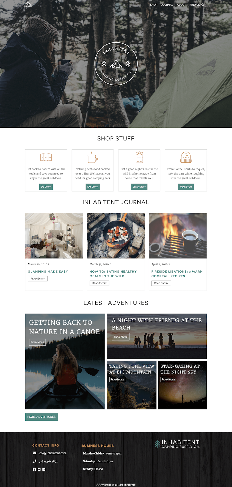

# Project-04-Inhabitent
  A multi-page website with a blog for a camping supply company called Inhabitent Camping Supply Co. 
 
## Goals 
  To be able to create a multi-page website for a company called Inhabitent Camping Supply Co. using WordPress as a content management system.
  
 ### Technologies
 * Visual Code
 * Wordpress - an open source software you can use to create a beautiful website, blog, or app.
 * HTML
 * SASS
 * JQuery
 * PHP
 * Javascript
 
 #### Installation Required
 * npm 
 * MAMP
 * gulp
 * Wordpress
 
 #### Learnings
 * Create pages and posts using wordpress, and customize menus and widgets.
 * WordPress hooks—actions and filters—and use them in the functions.php file.
 * How to install wordpress plugins for debugging purposes and to improve development workflows.
 * Create custom post types and taxonomies using WordPress functions.
 * Create theme files specific for displaying custom post type posts and archives, and custom taxonomy archives.
 * How to apply and change themes in Wordpress. 
 * Develop custom page templates and apply them to pages via the WordPress admin area.
 * How to modify existing themes in Wordpress and style it through sass.
 * Create template page and code PHP language for Wordpress.
 * Understands how to use template hierarchy 
 
